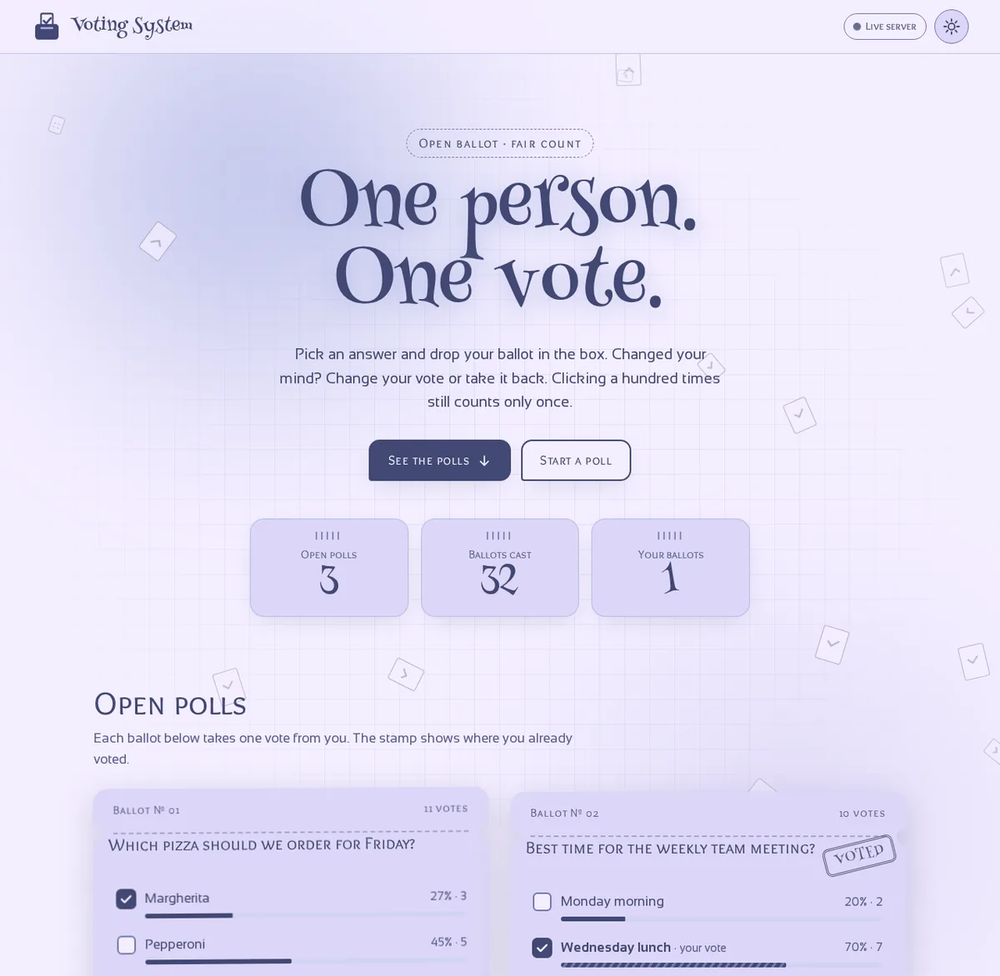
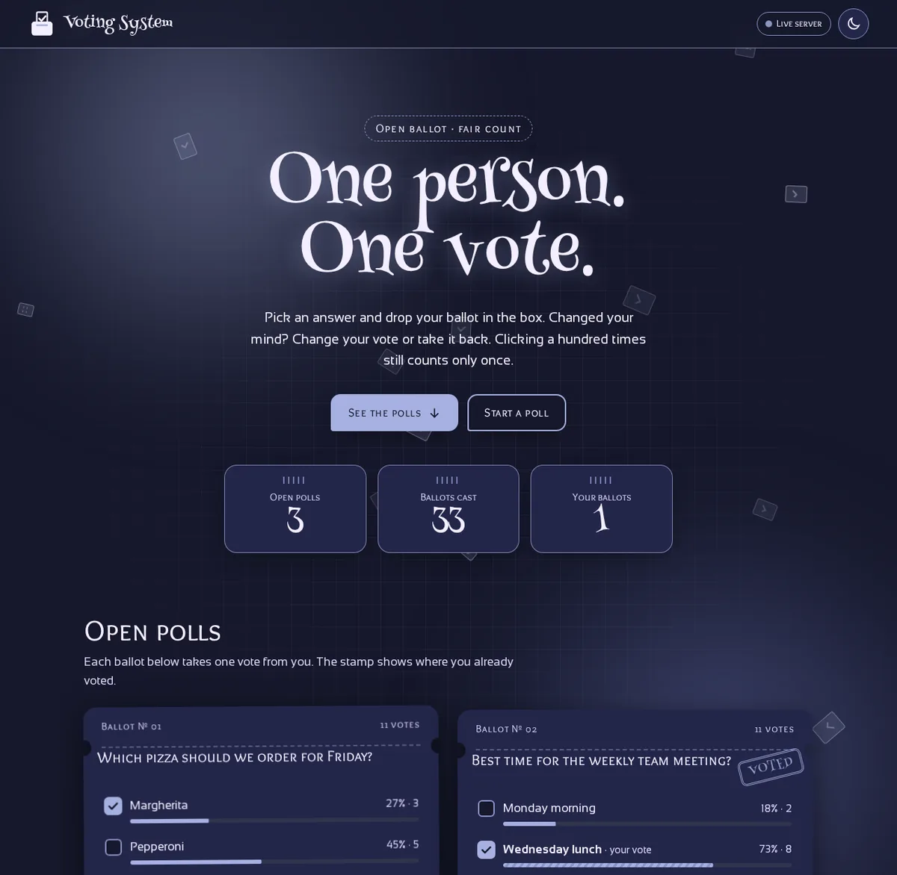
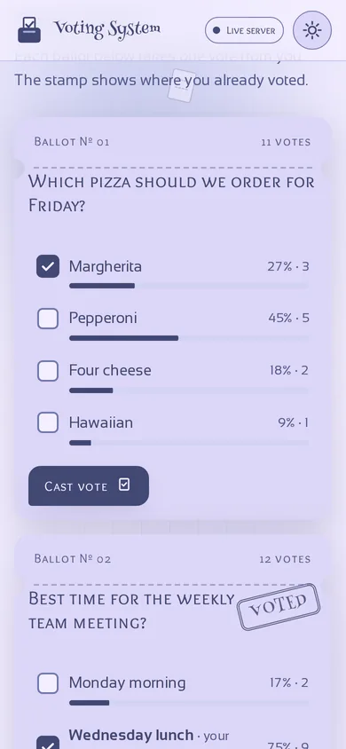
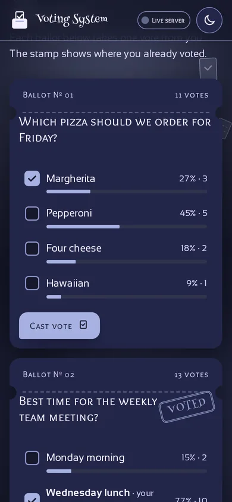

<div align="center">

[English](README.md) · **Lietuvių**

# 🗳️ Voting System

Draugiška balsavimo programėlė, kurioje kiekvienas turi lygiai **vieną balsą kiekvienam balsavimui**: gali jį atiduoti, pakeisti arba atsiimti.

[**Gyva demo versija**](https://brutall100.github.io/voting-system/) · [**Kodas**](https://github.com/brutall100/voting-system)



</div>

<p align="center">
  
  
  
</p>

## Apie projektą

Iš pradžių tai buvo paprastas „už / prieš“ skaitiklis. Mygtuką buvo galima spausti be galo, o skaičius vis augo. Dabar tai maža balsavimo programėlė, pastatyta ant vienos teisingos taisyklės: **vienas žmogus, vienas balsas**.

Kiekvienas balsavimas atrodo kaip popierinis biuletenis su perforuotu kraštu. Kai balsuoji, mažas lapelis įskrenda į kortelę, o ant jos nusileidžia guminis antspaudas **„Voted“**. Fone lėtai kyla popieriniai biuleteniai, lyg lapai šiltame ore.

Programėlė veikia dviem režimais:

| Režimas | Kur | Kur saugomi balsai |
|---|---|---|
| **Demo režimas** | GitHub Pages (gyva demo versija) | Tavo naršyklėje (`localStorage`) |
| **Tikras serveris** | Tavo kompiuteryje, paleidus `npm start` | Tikroje SQLite duomenų bazėje |

Puslapis pats patikrina, ar serveris veikia. Ženkliukas viršuje parodo, kuriame režime esi.

## Galimybės

- ✅ **Vienas balsas vienam balsavimui.** Duomenų bazės pirminis raktas `(poll_id, voter_id)` neleidžia balsuoti antrą kartą, todėl daug paspaudimų vis tiek skaičiuojami kaip vienas.
- 🔁 **Balsą galima pakeisti.** Pasirinkus kitą atsakymą, balsas persikelia, o bendra suma nesikeičia.
- ↩️ **Balsą galima atsiimti** visiškai.
- ➕ **Galima kurti balsavimus** su 2–6 atsakymais. Tušti ir pasikartojantys atsakymai atmetami.
- 📊 **Rezultatai iš karto** su procentų juostelėmis ir „suskaičiuojančiais“ skaičiais.
- 🕵️ **Anonimiška.** Nereikia nei vardo, nei registracijos. Kiekviena naršyklė gauna atsitiktinį ID `httpOnly` slapuke.
- 🌗 **Šviesus ir tamsus režimai.** Prisitaiko prie sistemos, turi perjungimo mygtuką, įsimena pasirinkimą ir nemirga kraunantis.
- 🎈 **Gyvas fonas:** kylantys popieriniai biuleteniai, švelnūs švytėjimai ir linijuoto popieriaus tinklelis.
- ♿ **Prieinama:** „Skip to content“ nuoroda, matomas fokusas, tikri `<label>`, `prefers-reduced-motion` palaikymas ir WCAG AA kontrastas.
- 📱 **Veikia telefone** (išbandyta 390px pločiu, puslapis neslenka į šoną).

## Naudotos technologijos

- **HTML, CSS ir paprastas JavaScript**, be jokio karkaso ar surinkimo žingsnio.
- **Node.js 22** ir **Express 5** API daliai.
- **SQLite, įdėta į pačią Node.js** (`node:sqlite`), todėl nereikia nei duomenų bazės serverio, nei XAMPP.
- **`node:test`** API testams.
- **Playwright** ekrano nuotraukoms ir naršyklės patikroms.

### Spalvų paletė

| Spalva | HEX | Kur naudojama |
|---|---|---|
|  | `#F4EEFF` | Puslapio fonas (šviesus), tekstas (tamsus) |
|  | `#DCD6F7` | Biuletenių kortelės ir paviršiai |
|  | `#A6B1E1` | Švytėjimai ir dekoras; mygtukai tamsiame režime |
|  | `#424874` | Tekstas ir mygtukai (šviesus) |
|  | `#16182B` | Tamsaus režimo fonas (tamsus `#424874` atspalvis) |

Kontrastas patikrintas skaičiais: `#424874` ant `#F4EEFF` yra **7.7:1**, o ant kortelių **6.2:1**. `#A6B1E1` per šviesus tekstui ant šviesaus fono (1.9:1), todėl ten jis naudojamas tik švytėjimams ir dekorui. Tamsiame režime jis tampa mygtukų spalva (**8.3:1**).

Visos spalvos yra CSS kintamieji faile [`css/style.css`](css/style.css) viršuje, todėl paletę galima pakeisti per minutę.

### Šriftai (Google Fonts)

- **Henny Penny** logotipui, didelei antraštei, skaičiams ir antspaudui.
- **Overlock SC** antraštėms, mygtukams ir biuletenių klausimams.
- **Sansation** paprastam tekstui.

## Ko išmokau

- Kaip padaryti, kad taisyklės būtų neįmanoma pažeisti pačioje duomenų bazėje (sudėtinis pirminis raktas ir `ON CONFLICT ... DO UPDATE`), o ne tik tikrinti ją JavaScript'e.
- Kodėl SQL užklausose reikia `?` placeholder'ių ir niekada negalima tiesiog įklijuoti vartotojo teksto.
- Kaip viena sąsaja gali dirbti su dviem „galais“: serverio API ir `localStorage` demo.
- Kaip padaryti gyvą animuotą foną, kuris nestabdo puslapio: animuojami tik `transform` ir `opacity`, o telefone dalelių mažiau.
- Temos per CSS kintamuosius, tamsus režimas be mirgėjimo ir kontrasto tikrinimas tikrais skaičiais.
- API testai su įdėtu `node:test`.

## Paleisti savo kompiuteryje

Reikia **Node.js 22.5 ar naujesnės** versijos ([parsisiųsti](https://nodejs.org/)).

```bash
git clone https://github.com/brutall100/voting-system.git
cd voting-system
npm install
cp .env.example .env    # nebūtina: jei nori pakeisti portą ar DB vietą
npm start
```

Atidaryk **http://localhost:3000**. Ženkliukas turi rodyti **„Live server“**.

`.env` faile yra trys nustatymai (be jo irgi veikia):

| Kintamasis | Numatytoji reikšmė | Ką daro |
|---|---|---|
| `PORT` | `3000` | Portas, kuriuo veikia serveris |
| `DB_FILE` | `data/votes.db` | Kur saugomas SQLite duomenų bazės failas |
| `SEED_SAMPLE_POLLS` | `true` | Prideda tris pavyzdinius balsavimus, kai DB tuščia |

Kitos komandos:

```bash
npm run dev   # perkrauna serverį, kai pakeiti failą
npm test      # paleidžia API testus
```

**Demo režimas be serverio:** atidaryk svetainę GitHub Pages arba prie adreso pridėk `?demo` (`http://localhost:3000/?demo`). Tada balsai lieka tik tavo naršyklėje.

> Node 22 parodo įspėjimą `ExperimentalWarning: SQLite is an experimental feature`. Taip ir turi būti, viskas veikia.

## Projekto struktūra

```text
voting-system/
├── index.html            # puslapis
├── css/
│   └── style.css         # visi stiliai; paletė :root viršuje
├── js/
│   ├── theme-init.js     # nustato išsaugotą temą prieš piešiant (be mirgėjimo)
│   ├── store.js          # duomenys: ServerStore (API) ir DemoStore (localStorage)
│   ├── background.js     # kylantys biuleteniai gyvame fone
│   ├── effects.js        # temos jungiklis, ripple, atsiradimas slenkant, skaičiavimas, pranešimai
│   └── app.js            # biuletenių piešimas, balsavimas, naujo balsavimo forma
├── images/
│   └── favicon.svg
├── server/
│   ├── server.js         # paleidimo taškas (npm start)
│   ├── app.js            # Express maršrutai ir patikra
│   └── db.js             # SQLite schema ir užklausos
├── test/
│   └── api.test.js       # API testai (npm test)
├── docs/                 # ekrano nuotraukos šiam README
├── .env.example
├── package.json
└── LICENSE
```

### API

| Metodas | Kelias | Ką daro |
|---|---|---|
| `GET` | `/api/health` | Praneša puslapiui, kad serveris veikia |
| `GET` | `/api/polls` | Visi balsavimai su rezultatais ir tavo balsu |
| `POST` | `/api/polls` | Sukuria balsavimą: `{ "question": "...", "options": ["A", "B"] }` |
| `PUT` | `/api/polls/:id/vote` | Atiduoda arba pakeičia balsą: `{ "optionId": 3 }` |
| `DELETE` | `/api/polls/:id/vote` | Atsiima balsą |

## Padėkos

- Šriftai: [Henny Penny](https://fonts.google.com/specimen/Henny+Penny), [Overlock SC](https://fonts.google.com/specimen/Overlock+SC) ir [Sansation](https://fonts.google.com/specimen/Sansation) iš Google Fonts (SIL Open Font License).
- [Express](https://expressjs.com/) (MIT).
- Ikonos ir piešinėliai sukurti ranka kaip SVG.

## Licencija

[MIT](LICENSE) © 2026 brutall100
